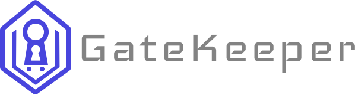

    
    

# Introduction

THe GateKeeper is a lightweight and secure microservice for user authentication and session management. It handles user registration, password management, token-based authentication, and session lifecycle. Designed for scalability and cloud-native systems, it offers flexibility, reliability, and easy integration with role-based access control (RBAC).

## Password Hashing

GateKeeper use the Argon2 algorithm for password hashing, which is currently considered one of the most secure hashing algorithms. Argon2 provides resistance against both GPU and ASIC attacks, making it an excellent choice for protecting user passwords.

## Database

By default, the application is configured to use the PostgreSQL, which is a powerful, open-source relational database system. PostgreSQL is known for its robustness, extensibility, and standards compliance. It supports advanced data types and performance optimization features, making it a suitable choice for handling complex queries and large datasets.